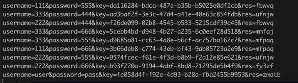

# CaptchaKiller

Burp 验证码识别插件

# 参考

https://github.com/f0ng/captcha-killer-modified

# 改动

1. 增加了验证码Key识别
2. 适配了新版本burp的api
3. JDK21起步

# 安装

Burp version >= 2024.7，建议持续使用最新版本

Python >=3.7，

# 使用方法

1. 接口Url：填写用于识别验证码图片结果的url，发送方法为：POST+图片二进制
2. 验证码URL：填写验证码图片的获取地址，在下方的Request中填入完整的数据包
3. KeyBodyReg：填入正则，用于匹配验证码响应包中的key信息，有两种模式，
    1. KeyReg：正则匹配
    1. KeyNone：无key关键字，不获取key信息
    1. KeyJson: 从Json中提取字段（未实现，Reg目前足以）
    1. KeyXml: 从XMl中提取字段（未实现，Reg目前足以）
4. CapBodyReg：填入正则，用于匹配验证码响应包中的图片信息，有三种模式，
    1. ImgAllBytes：获取二进制Img图片字节
    1. ImgAllBase64：获取所有的响应Base64编码数据
    1. ImgRegBase64：正则匹配Base64编码数据
    1. ImgJsonBase64：从Json中提取字段（未实现，Reg目前足以）
    1. ImgXmlBase64：从XMl中提取字段（未实现，Reg目前足以）
5. 启用Replace模式：一种替换数据包关键字的方法
6. 是否更新验证码表：暴力破解时插件右侧的验证码表，是否持续更新

填入上述信息，启用Python3 server.py

## PayloadGen模式

对应Burp功能，会不断的请求验证码数据包获取完整的验证码，该功能安装后持续可用

## Replace模式

需要开启`启用Replace模式`功能，开启后会自动替换Intruder中暴力破解数据包中`@CaptchaKey@`,`@CaptchaRes@`
的值为验证码的识别结果，包括Key与图片识别结果

# 演示

## PayloadGen模式

后端数据包如下：

可以正确识别验证码和验证码关键字

## Replace模式

后端数据包如下：

可以正确识别验证码和验证码关键字

